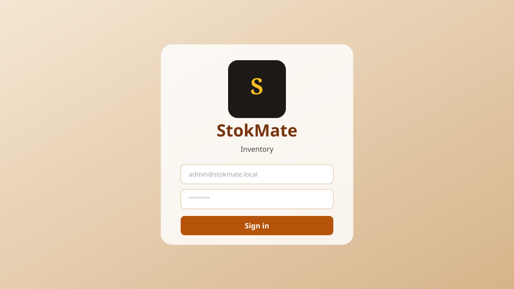
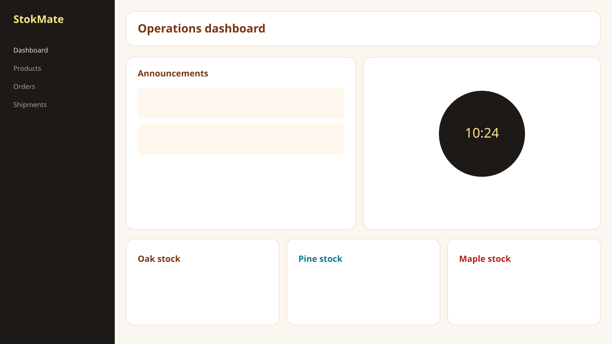
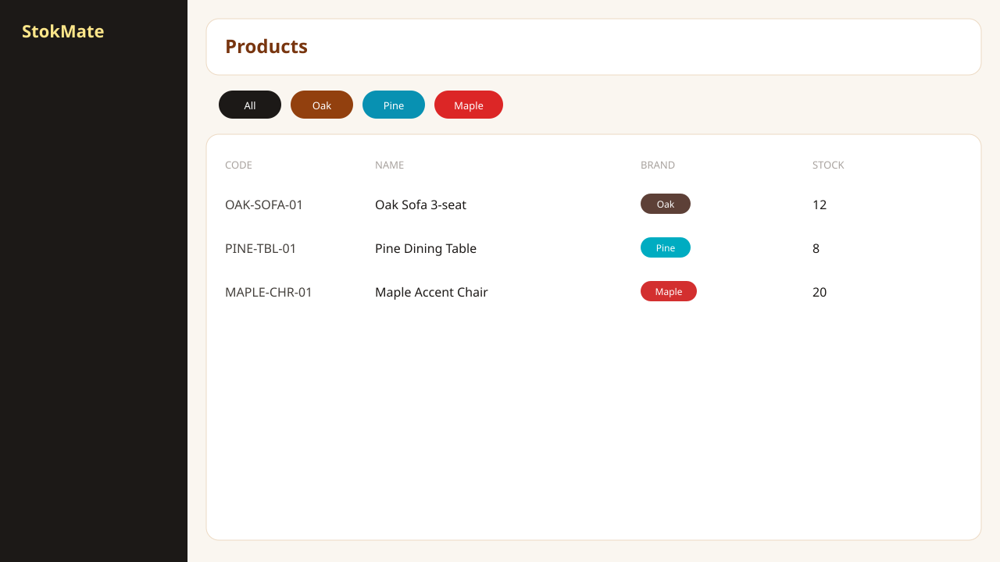
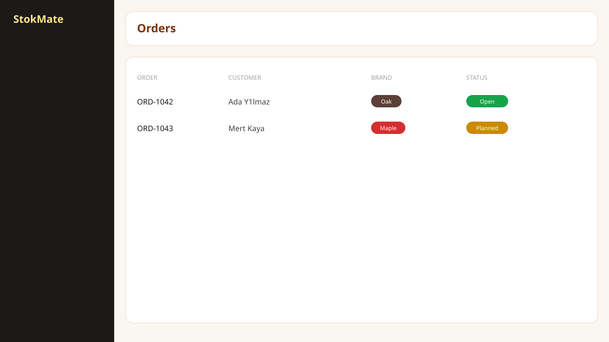

# StokMate

[](LICENSE)
[](https://openjdk.org/)
[](https://spring.io/projects/spring-boot)
[](https://react.dev/)
[](https://www.postgresql.org/)

**Open-source multi-store inventory, sales and shipment operations — Spring Boot + React.**

[Türkçe README](README.tr.md)

StokMate is a self-hosted operations console for retailers that run more than one store or warehouse. It covers stock, customer orders, inbound receipts, outbound shipments, counter sales, vehicles, role-based dashboards, JWT auth with optional 2FA, invoice files on MinIO, and PDF delivery slips.

It was used in production for about half a year. Customer-specific branding has been replaced with a generic sample catalog (`Oak`, `Pine`, `Maple`) so you can fork it for your own business.



<p align="center">
  
  
</p>

<p align="center">
  
  
</p>

## Features

- Multi-store stock with sample brands you can rename
- Customer orders, warehouse intake, and shipment planning / delivery
- Counter sales and product search
- Vehicles, reports, notes, and in-app notifications
- Role-based dashboards (admin, manager, director, store, operations, logistics)
- JWT authentication and optional TOTP 2FA
- Invoice objects in MinIO and PDF shipment / delivery reports

## Quick start

You need Docker and Docker Compose.

```bash
git clone https://github.com/enesiyidil/stokmate.git
cd stokmate
cp .env.example .env
docker compose up --build
```

Then open **http://localhost:8080** and sign in with:

- Email: `admin@stokmate.local`
- Password: value of `ADMIN_PASSWORD` in `.env` (change the example default)

The `demo` Spring profile (on by default in Compose) creates two sample stores and three catalog products on an empty database.

| Service | URL |
| --- | --- |
| UI | http://localhost:8080 |
| API / Swagger | http://localhost:9090/swagger-ui/index.html |
| MinIO console | http://localhost:9001 |

**Change `JWT_SECRET`, `ADMIN_PASSWORD`, and database passwords before any shared or internet-facing deploy.** SMTP is optional; leave `SMTP_USERNAME` / `SMTP_PASSWORD` empty if you do not need mail.

## Local development

**Backend** (Java 17, Maven):

```bash
cd backend
cp .env.example .env
docker compose up -d
mvn spring-boot:run
```

**Frontend** (Node 20+):

```bash
cd frontend
cp .env.development.example .env.development
npm install
npm run dev
```

Vite serves http://localhost:5173 and proxies `/api` to http://localhost:9090.

## Repository layout

```
backend/     Spring Boot 3.3 API (port 9090)
frontend/    React 19 + Vite + Tailwind UI
docs/        deploy notes and screenshots
```

## Security

Do not commit `.env` files or database dumps. If you ever committed a real mail password or JWT secret, rotate it immediately and treat it as public. See [SECURITY.md](SECURITY.md).

## Contributing

Contributions are welcome. Please read [CONTRIBUTING.md](CONTRIBUTING.md) and the [code of conduct](CODE_OF_CONDUCT.md). Issues labeled `good first issue` are a good place to start.

## License

[MIT](LICENSE) © 2026 Enes İyidil
